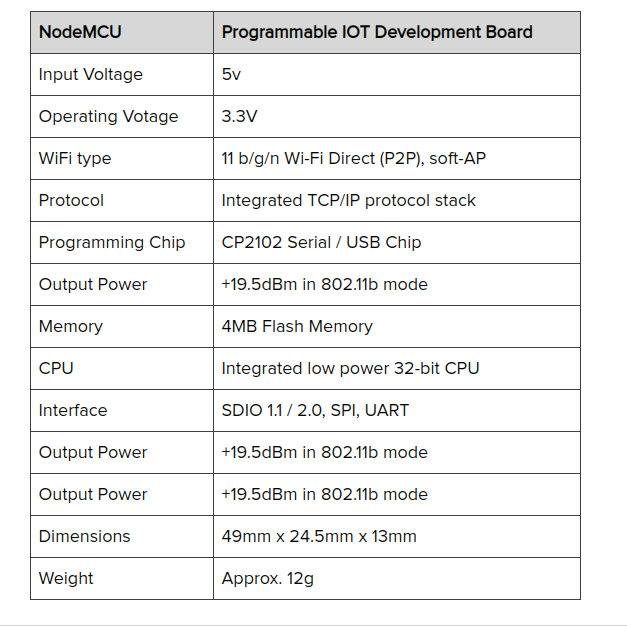

Motivation
==========

Food production areas are prone to much air pollution as they will be using inflammable fuels,burning coal and other organic matter.
Despite this pollution, these areas should be kept clear of other air pollutants and gases.

Overview
========

In this project we monitor the air pollutants(Particulates,Volatile Organic Compounds,Carbon monoxide,Nitrogen dioxide,Ammonia,Methane,Propane etc) in food production areas.

The data which is collected is then sent to cloud for easy monitoring and analytics.

Here we basically collect the amount of pollutants and check the levels to assure the safety of the workers and the standards of the food.

Importance
==========

Need of our Project

**AQI**

The AQI is an index for reporting daily air quality. It tells you how clean or polluted your air is, and what associated health effects might be a concern for you. EPA calculates the AQI for five major air pollutants regulated by the Clean Air Act: ground-level ozone, particle pollution (also known as particulate matter), carbon monoxide, sulfur dioxide, and nitrogen dioxide. EPA has established national air quality standards to protect public health .
We use our collected data and make a AQI value and compare to the above standards to ensure a healthy environment.

AQI The higher the AQI value, the greater the level of air pollution and the greater the health concern.

Description
===========

Goals 

**Goals**

-   Measure the air quality index in the messes

-   To upload the air quality index to the cloud regularly to ensure the safety levels are not crossed.

-   To analyze the data collected and provide a solution if the safety levels are breached

Implementation 

**Steps**

-   Making the layout of the circuit

-   Connecting the sensors and controller according to the circuit

-   Writing of the code to test the sensors

-   Building of a datbase in a cloud to store the data collected

-   Update the code to connect the microcontroller to the cloud

-   Designing the final structure of the node

-   Deployment of the device

-   Analyzing the data stored in the cloud

Deployment

At the time of deployment of the, each node contains:-

1.  All the sensors with board(enclosed)

2.  jio-fi

3.  powerbank(power supply)

In the end 4 such node are deployed i.e 2 node in each mess

-   NBH mess

-   North mess

List of Sensors and Controllers

-   NodeMCU

-   Nova PM2.5 - PM10 - High Precision Air Particulate Matter Sensor

-   Digital Temperature and Humidity Sensor

-   Grove multichannel gas sensor

-   Grove - VOC and eCO2 Gas Sensor

Tools and Technologies
======================

NodeMCU
=======

NodeMCU

NodeMCU is an open source LUA based firmware developed for ESP8266 wifi chip.The ESP8266 is a low-cost Wi-Fi chip developed by Espressif Systems with TCP/IP protocol. NodeMCU Dev Kit has Arduino like Analog (i.e. A0) and Digital (D0-D8) pins on its board.It supports serial communication protocols i.e. UART, SPI, I2C etc.

NodeMCU Specifications 

NodeMCU vs esp32 ESP32 is more expensive than the ESP8266.Additionally, because it is more recent than the ESP8266, not all software has been developed to take the most out of the ESP32 functionalities, there is less support, and more bugs. But on the long run these issues will be fixed, and there will be space for both boards.

Nova PM2.5 - PM10 (SDS011)
==========================

Nova PM2.5 - PM10 (SDS011) The SDS011 using principle of laser scattering,can get the particle concentration between 0.3 to 10μm in the air. It gives direct digital output via serial protocol at 9600bps and also over 2 PWM channels. There is a built-in fan for stable and reliable operations. 

Nova PM2.5 - PM10 (SDS011) Specifications 

Nova PM2.5 - PM10 (SDS011) Pin Layout

-   Pin 1 - not connected

-   Pin 2 - PM2.5: 0-999μg/m³; PWM output

-   Pin 3 - 5V

-   Pin 4 - PM10: 0-999 μg/m³; PWM output

-   Pin 5 - GND

-   Pin 6 - RX UART (TTL) 3.3V

-   Pin 7 - TX UART (TTL) 3.3V

SDS011 vs SPS30 
SPS30 has sophisticated technology with high quality and long-lasting compounds which is used mostly for accurate measurements and which also makes it very expensive.For household environments SDS011 provides ease than SPS30.

DHT22 AM2302 Module
===================

DHT22 AM2302 Module It uses a capacitive humidity sensor and a thermistor to measure the surrounding air, and spits out a digital signal on the data pin (no analog input pins needed). Its fairly simple to use, but requires careful timing to grab data. The only real downside of this sensor is you can only get new data from it once every 2 seconds, so when using our library, sensor readings can be up to 2 seconds old. 

DHT22 AM2302 Module Specifications

-   Low cost

-   3 to 5V power and I/O

-   2.5mA max current use during conversion (while requesting data)

-   Good for 0-100

-   Good for -40 to 80$^circ$C temperature readings 0.5$^circ$C accuracy

-   No more than 0.5 Hz sampling rate (once every 2 seconds)

-   Body size 15.1mm x 25mm x 7.7mm

-   4 pins with 0.1" spacing

DHT22 AM2302 Pin Layout 

DHT22 vs DHT11 The DHT22 is the more expensive version which obviously has better specifications. Its temperature measuring range is from -40 to +125 degrees Celsius with +-0.5 degrees accuracy, while the DHT11 temperature range is from 0 to 50 degrees Celsius with +-2 degrees accuracy. Also the DHT22 sensor has better humidity measuring range, from 0 to 100% with 2-5% accuracy, while the DHT11 humidity range is from 20 to 80% with 5% accuracy. 

Grove multichannel gas sensor
=============================

Grove multichannel gas sensor Grove Multichannel Gas sensor is a environment detecting sensor with a built in MiCS-6814 which can detect many unhealthful gases, and three gases can be measured simultaneously due to its multi channels, so it can help you to monitor the concentration which more than one gas. 

Grove multichannel gas sensor (MICS 6814) Characteristics 

Grove multichannel gas sensor (MICS 6814) Specifications **Features**

-   Three fully independent sensing elements on one package

-   Built with ATmega168PA

-   I2C interface with programmable address

-   Heating power can be shut down for low power

-   Detectable gases

-   Carbon monoxide CO 1 to 1000ppm

-   Nitrogen dioxide NO2 0.05 to 10ppm

-   Ethanol C2H6OH 10 to 500ppm

-   Hydrogen H2 1 to 1000ppm

-   Ammonia NH3 1 to 500ppm

-   Methane CH4 >1000ppm

-   Propane C3H8 >1000ppm

-   Iso-butane C4H10 >1000ppm

Grove multichannel gas sensor (MICS 6814) Pin Layout 

MICS 6814 vs MICS 4514 
MICS 4514 has CO/NO2 dual sensor whereas MICS 6814 has CO/NO2/NH3 triple sensor. The CO and NO2 measurements are taken by means of the MiCS-4514 MicroElectroMechanical Sensor (MEMS) [30]. This is a sensor typically used in automotive applications (e.g., to measure emissions from automobile exhausts). Hence, it is optimized for high concentration of gases,but in human environment where we don’t have such high concentrations, MICS 6814 works efficiently.

Grove - VOC and eCO2 Gas Sensor(SGP30)
======================================

Grove - VOC and eCO2 Gas Sensor(SGP30) The Grove-VOC and eCO2 Gas Sensor(SGP30) is an air quality detection sensor. This grove module is based on SGP30, provided TVOC(Total Volatile Organic Compounds) and CO2eq output for this module. 

Grove - VOC and eCO2 Gas Sensor(SGP30) Specifications 

SGP30 Pin Layout 

SGP30 vs CCS811 

From a firmware perspective SGP30 is almost as easy as the CCS811. From the test data, SGP30 is way more sensitive than the CCS811. If you are in an environment where you need to know SGP30 is the one to pick. SGP30 is widely available though many channels.

Technology
==========

Technology **Connecting to Cloud**
The program connects to the Wi-Fi network using the provided password and SSID. It then proceeds to connect to the provided cloud/host server , and sends the provided URI to the host server.
Once the data has been successfully sent, the sketch waits for a reply from the server. The process is repeated until the ESP8266 is turned off.
